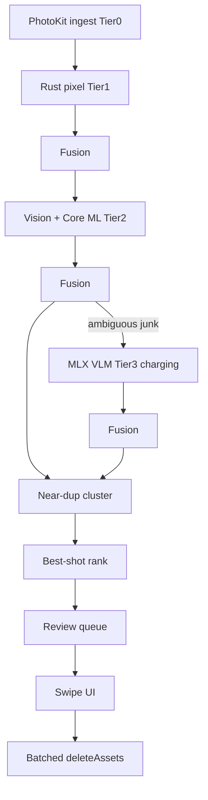

# Architecture

## Goals

1. **Fast by default** — cheap signals on every photo; expensive models only on the uncertain subset.
2. **Trust** — explain every flag; no cloud photo upload; undoable deletes.
3. **Rust owns logic, Swift owns platform** — PhotosKit, Vision, Core ML, MLX, BGTaskScheduler stay in Swift.

> Note: MLX runs on the GPU via Metal, not the Neural Engine. Core ML models use the Neural Engine; MLX is reserved for the optional VLM.

## Cascade

### Tier 0 — metadata
`mediaSubtypes`, burst id, timestamps, location, favorite/hidden. Favorites and hidden assets are never flagged.

### Tier 1 — Rust pixels (256px)
Laplacian blur, exposure histogram, dHash, pocket-shot uniformity.

### Tier 2 — Vision + Core ML (Neural Engine)
- Faces: landmarks + capture quality → blink / looking-away / mouth-open (experimental)
- Text / barcodes / document segmentation → receipts, labels, tracking slips
- SigLIP embedding → near-dup clustering, zero-shot junk prompts, aesthetic MLP head
- Saliency → composition features

### Tier 3 — VLM (MLX, charging only)
Constrained JSON prompt on the ambiguous residual (~5–15%). Disabled below 6 GB RAM.

## Fusion

`cleaner-core` combines signals into calibrated `junk`, `miss`, and `aesthetic` scores plus `Vec<Reason>`. Weights live in versioned TOML (`core/cleaner-core/weights/default.toml`).

## Clustering & ranking

Time-window (±30s) + optional location → union-find on dHash distance and embedding cosine. Rank = `aesthetic + face_quality + sharpness − miss_penalty`. Best kept; rest queued with “better shot exists”.

## Scheduler

`BGProcessingTaskRequest.requiresExternalPower = true`. Swift reports thermal + battery; Rust pauses at `.serious`+, shrinks batches at `.fair`, and checkpoints after every batch.

## Repo map

| Path | Role |
|---|---|
| `core/cleaner-core` | Signals, fusion, cluster, rank, queue, scheduler |
| `core/cleaner-store` | SQLite migrations + persistence |
| `core/cleaner-ffi` | UniFFI surface for Swift |
| `core/cleaner-cli` | Offline eval harness |
| `ios/` | SwiftUI app + PhotoBridge / Analyzers / VLM packages |
| `models/` | Conversion scripts + licenses |
| `eval/` | Labeled benchmark hooks |
