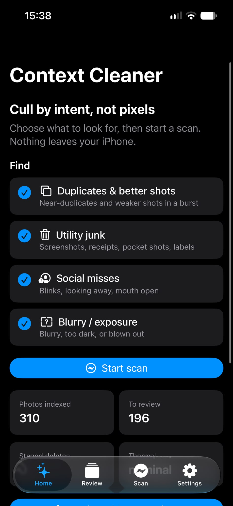
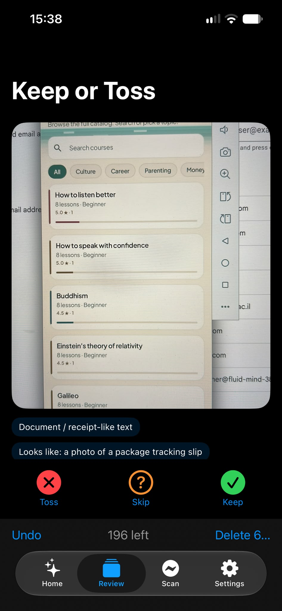
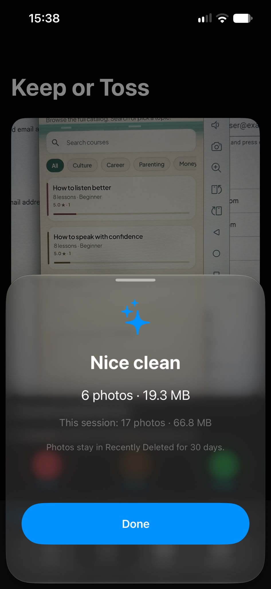

# Context Cleaner

<p align="center">
  <strong>Cull by intent, not pixels.</strong><br/>
  Privacy-first photo cleanup for iOS 18+ — on-device models, explainable Keep/Toss, deletes go to Recently Deleted.
</p>

<p align="center">
  
  
  
  
</p>

<p align="center">
  
  
  
</p>

---

## The problem

Your camera roll is full of **utility junk** (receipts, whiteboard shots, screenshots of screenshots), **social misses** (blinks, looking away), and **weaker frames** from every burst. Apple’s duplicate finder is pixel-matching. Most “cleaner” apps are freemium traps that want your photos in the cloud.

**Context Cleaner** asks a different question: *what was the human trying to do with this photo?* Then it explains why something should go.

## What it finds

| Find | How it knows |
|------|----------------|
| **Duplicates & better shots** | Near-dup clusters; aesthetic + face quality + sharpness − miss penalty |
| **Utility junk** | Vision text/barcode/document + SigLIP zero-shot + optional VLM |
| **Social misses** | Face landmarks — blink, looking away (mouth-open experimental) |
| **Blurry / exposure** | Laplacian sharpness + exposure histogram |

You pick categories before a scan. Review is swipe cards with **reason chips** — not a black-box score.

## Privacy, for real

- Photos **never leave the device**
- No accounts, no ads, no analytics
- Deletes → **Recently Deleted** (30-day undo via Apple)
- One optional network path: checksum-verified VLM weights you opt into in Settings

Details: [PRIVACY.md](PRIVACY.md)

## How it works

Cheap signals on every photo; expensive models only on the uncertain subset — and heavy VLM work prefers **charging**.

```
SwiftUI  →  PhotosKit / Vision / Core ML / MLX
    ↕ UniFFI
Rust     →  signals · fusion · clustering · ranking · SQLite · thermal scheduler
```

Cascade: metadata → Rust pixels → Vision + Core ML → optional MLX VLM → near-dup clusters → ranked review queue.

Full story: [ARCHITECTURE.md](ARCHITECTURE.md)

## Requirements

- macOS + Xcode 16+
- Rust stable (`rustup`)
- iOS 18+ device (A15+ recommended; VLM needs ≥6 GB RAM)
- [XcodeGen](https://github.com/yonaskolb/XcodeGen): `brew install xcodegen`

## Build & run

```bash
# 1. Rust core → XCFramework + Swift bindings
./scripts/build-xcframework.sh

# 2. Generate & open the iOS project
cd ios && xcodegen generate
open ContextCleaner.xcodeproj
```

Set your Development Team in Xcode, then run on a **real device** — PhotoKit needs a real library to feel like the product.

### Rust-only (fast iteration)

```bash
cd core
cargo test --workspace
cargo run -p cleaner-cli -- weights
```

## Models

Bundled Core ML (SigLIP + aesthetic head) plus optional on-device VLM. Licenses, sizes, and conversion scripts: [models/MODELS.md](models/MODELS.md).

## Contributing

See [CONTRIBUTING.md](CONTRIBUTING.md). Fusion weights are TOML-tunable without touching Rust:

```bash
cargo run -p cleaner-cli -- weights > my-weights.toml
# edit, then load via CleanerEngine.setWeightsToml in the app
```

## License

[MIT](LICENSE) © 2026 Gidi Hanoch
